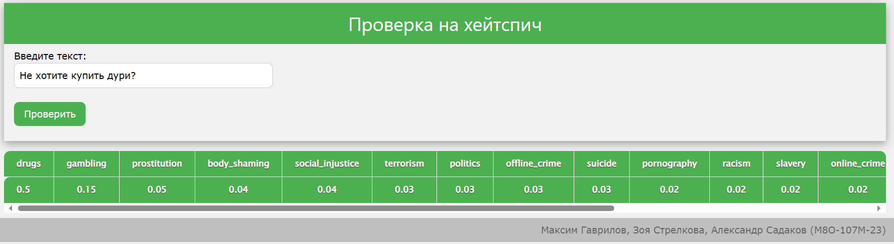

# М.О.Х. (Модуль определения хейтспича)
---
## Бизнес цель проекта
Целью проекта является создание модуля для нашего сервиса микроблогов, который способен автоматически выявлять наличие хейтспича (агрессивных и оскорбительных выражений) в текстовых постах и комментариях. Мы стремимся создать безопасное и дружественное онлайн-сообщество для пользователей нашего сервиса, предотвращая негативное и оскорбительное поведение в текстовых материалах. Это также может помочь улучшить общую репутацию и привлечь больше пользователей.

---
## ML цель проекта
Целью машинного обучения в данном проекте является разработка и обучение алгоритмов, способных эффективно выявлять хейтспич в текстовых материалах. Мы стремимся создать модель, которая будет обнаруживать агрессивный и оскорбительный контент с высокой точностью, что позволит нам предотвращать его публикацию и обеспечивать безопасную среду для пользователей. Это также включает в себя интеграцию алгоритмов машинного обучения в наш сервис микроблогов и их оптимизацию для обнаружения хейтспича.

---
## Состав команды (ФИО - Группа)
1. Гаврилов Максим Сергеевич (М8О-107М-23)
2. Садаков Александр Александрович (М8О-107М-23)
3. Стрелкова Зоя Юрьевна (М8О-107М-23)

---
## Ссылка на презентацию
Презентация по проекту доступна по [следующей ссылке](https://docs.google.com/presentation/d/1_NYJ3IGn3xxl0ZJFTGIwafujbZWyJQ81SgXYLgF6riY/edit#slide=id.g1ed78a0aa36_0_72).

---
## Как использовать
Для того чтобы запустить проект нужно сначала запустить сервер
```
python3 model_server_interface.py
```
После того, как сервер начал работу можно запустить клиент `client.py` и открыть [окно с пользовательским интерфейсом](http://localhost:8086/main/) в браузере, которое имеет следующий вид:

После ввода текста и отправки запроса на проверку, в таблице ниже появляются оценки возможной категории хейтспича, отсортированные по возрастанию (первый столбец содерит наиболее возможный тип недопустимого теста и его вероятность, последний --- наимее возможный). В качестве вероятности выступает число от 0 до 1, где 0 --- точно не принадлежит данной категории, а 1, соответственно, точно принадлежит.
